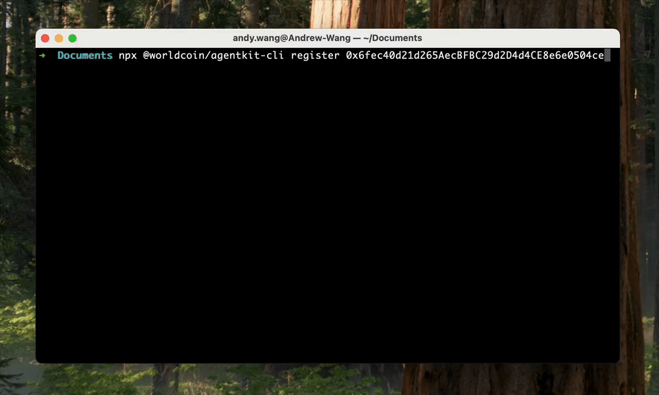

<div align="center">

# **AgentKit**

**Verify that an agent is backed by a real, [World ID-verified human](https://docs.world.org/agents/agent-kit).**



</div>

## Skills
For your Agent to use your registration when accessing x402 endpoints
```bash
npx skills add worldcoin/agentkit agentkit-x402 
```

For developers building x402 servers, add the integration guide to your knowledge base:
```bash
npx skills add worldcoin/agentkit integrate-agentkit
```

## How it Works

1. An agent wallet is registered in AgentBook using a World ID proof.
2. A website or API using x402 challenges the agent to sign a CAIP-122 message.
3. The server verifies the signature, resolves the registering human from AgentBook, and applies the configured access policy.

This lets applications distinguish between arbitrary automation and automation acting on behalf of a real human, without exposing the human's underlying identity.

## For Agents

### Register

Register your wallet in AgentBook so servers can verify you are human-backed. Registration is gasless by default (uses a hosted relay on Base mainnet).

```bash
npx @worldcoin/agentkit-cli register <your-wallet-address>
```

This will prompt a World ID verification via World App. You only need to register once per wallet.

Check whether a wallet is already registered:

```bash
npx @worldcoin/agentkit-cli status <your-wallet-address>
```

For the full registration guide (manual mode, custom relays, Base Sepolia): [`./cli/REGISTRATION.md`](./cli/REGISTRATION.md)

### Use

Once registered, create an AgentKit client and use `agentkit.fetch` for x402 HTTP calls. It tries AgentKit verification before payment and only leaves the normal x402 payment flow in place when verification is unavailable, fails, or is exhausted.

```bash
npm install @worldcoin/agentkit
```

```typescript
import { createAgentkitClient } from '@worldcoin/agentkit'

const agentkit = createAgentkitClient({
	signer: {
		address: agentWallet.address,
		chainId: 'eip155:8453',
		type: 'eip191',
		signMessage: message => agentWallet.signMessage(message),
	},
})

const response = await agentkit.fetch('https://api.example.com/data')
```

If your agent cannot change its HTTP client code, install the agent skill as fallback guidance:

```bash
npx skills add worldcoin/agentkit agentkit-x402
```

The full flow — parsing 402 responses, signing the CAIP-122 challenge, and sending the `agentkit` header — is documented in the agent skill: [`./skills/agentkit-x402/SKILL.md`](./skills/agentkit-x402/SKILL.md)

## For x402 Developers

### Integrate

Add AgentKit to your x402 server to offer human-backed agents free access, free trials, or discounts.

```bash
npm install @worldcoin/agentkit
```

For the full integration guide (client wrapper, hooks setup, access modes, World Chain payments, AgentBook configuration): [`./x402/DOCS.md`](./x402/DOCS.md)
